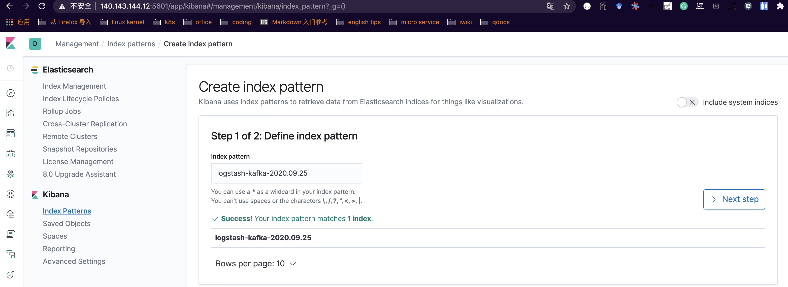
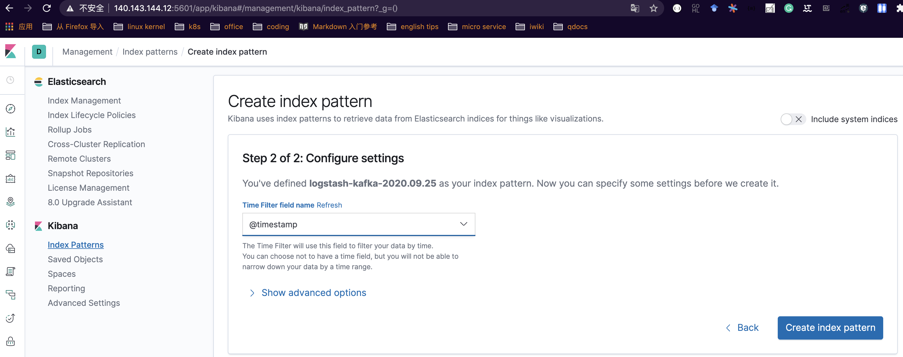
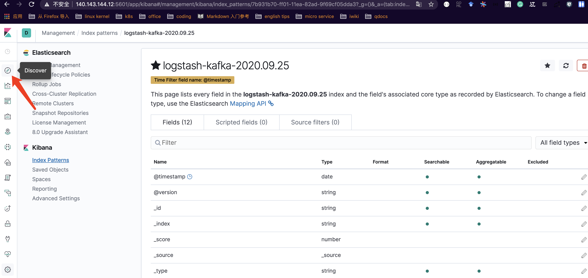
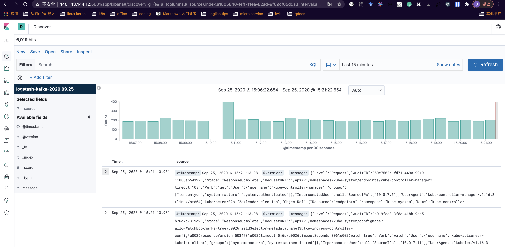

# audit-server
生产环境中， 一个正常运行的 Kubernetes 集群，除了利用访问控制对集群操作的许可进行限制之外，对于操作过程的跟踪审计也是比不可少的；所以，audit的统一收集和分析需求也是必要的，该项目要求基于golang 开发kubernetes audit 接收服务器，实现所有对象操作进行审计记录，并经审计记录写入到 kafka，通过logstash消费kafka中的audit记录，并将其写入到es集群，设置存储1个月，最后通过kibana 展现audit信息。

#### 部署 kafka
```
docker pull wurstmeister/zookeeper  
docker pull wurstmeister/kafka
docker run -d --name zookeeper -p 2181:2181 -t wurstmeister/zookeeper

docker run  -d --name kafka -p 9092:9092 -e KAFKA_BROKER_ID=0 -e KAFKA_ZOOKEEPER_CONNECT=192.168.1.100:2181 -e KAFKA_ADVERTISED_LISTENERS=PLAINTEXT://192.168.1.100:9092 -e KAFKA_LISTENERS=PLAINTEXT://0.0.0.0:9092 -t wurstmeister/kafka
```

#### 测试 kafka
1. 启动生产者：

```bash
[root@VM-7-14-centos ~]# docker exec -it kafka /bin/bash
bash-4.4# cd /opt/kafka
bash-4.4#  ./bin/kafka-console-producer.sh --broker-list localhost:9092 --topic mykafka
>123123
```
在生产者命令行中输入 123123，然后启动消费者，看是否可以查到该消息。

1. 启动消费者：

```bash
[root@VM-7-14-centos ~]# c'd
bash-4.4# cd /opt/kafka
bash-4.4# ls
LICENSE    NOTICE     bin        config     libs       logs       site-docs
bash-4.4# cd /opt/kafka^C
bash-4.4#    ./bin/kafka-console-consumer.sh --bootstrap-server localhost:9092 --topic mykafka --from-beginning
123123
```
至此，说明 kafka 部署完成；

#### 部署 elasticsearch
```
[root@VM-7-14-centos ~]# docker run --name elasticsearch -p 9200:9200 -p 9300:9300 -e "discovery.type=single-node" -d elasticsearch:7.2.0
验证是否安装成功: 
[root@VM-7-14-centos ~]# curl localhost:9200
{
  "name" : "702355dc4cdd",
  "cluster_name" : "docker-cluster",
  "cluster_uuid" : "wLSMR_3_Q52vJmUdkZQcMw",
  "version" : {
    "number" : "7.2.0",
    "build_flavor" : "default",
    "build_type" : "docker",
    "build_hash" : "508c38a",
    "build_date" : "2019-06-20T15:54:18.811730Z",
    "build_snapshot" : false,
    "lucene_version" : "8.0.0",
    "minimum_wire_compatibility_version" : "6.8.0",
    "minimum_index_compatibility_version" : "6.0.0-beta1"
  },
  "tagline" : "You Know, for Search"
}
```

修改es配置，解决跨域访问的问题：
```bash
[root@VM-7-14-centos ~]# docker exec -it elasticsearch bash
[root@702355dc4cdd elasticsearch]# cd /usr/share/elasticsearch/config/
[root@702355dc4cdd config]# vi elasticsearch.yml 
加入下面两个配置: 
http.cors.enabled: true
http.cors.allow-origin: "*"

[root@702355dc4cdd config]# cat elasticsearch.yml 
cluster.name: "docker-cluster"
network.host: 0.0.0.0
http.cors.enabled: true
http.cors.allow-origin: "*"
```

#### 部署 kibana

```bash
[root@VM-7-14-centos ~]# docker run --name kibana --link=elasticsearch:test -p 5601:5601 -d kibana:7.2.0
```
启动以后，就可以通过浏览器输入 http://ip:5601 ，访问kibana 界面了。

#### 部署logstash

Logstash工作的流程由三部分组成：
```
input：输入（即source），必须要有，指明从那里读取数据。
filter：过滤，logstash对数据的ETL就是在这个里面进行的，这一步可选。
output：输出（即sink），必须要有，指明数据写入到哪里去。
```

所以在我们的场景里面，input就是kafka，output就是es。至于是否需要filter，看你的场景需不需要对input的数据做transform了，本文没有使用filter。input需要使用logstash-input-kafka插件，该插件logstash默认就带了，可以使用bin/logstash-plugin list | grep kafka命令确认。

1. 创建一个的Logstash配置文件 logstash_dev.conf，内容如下：

```
input {
  kafka {
    bootstrap_servers => "localhost:9092"
    topics => ["mykafka"]
  }
}

output {
  elasticsearch {
    hosts => ["http://localhost:9200"]
    index => "logstash-kafka-%{+YYYY.MM.dd}"
  }
}
```

1. 运行Logstash

```bash
[root@VM-7-14-centos]# yum install java
[root@VM-7-14-centos]# wget https://artifacts.elastic.co/downloads/logstash/logstash-7.2.0.tar.gz
[root@VM-7-14-centos]# bin/logstash -f logstash_dev.conf
```
确保没有错误。然后我们在kafka中创建上述配置文件中的topic，并写入一些数据：

```bash
[root@VM-7-14-centos ~]#  docker exec -it kafka /bin/bash
bash-4.4# cd /opt/kafka
bash-4.4# ./bin/kafka-console-producer.sh --broker-list localhost:9092 --topic mykafka
>{"key1": "value1"}
>{"key2": "value2"}
```

查看索引:
```bash
[root@VM-7-14-centos ~]# curl "http://localhost:9200/_cat/indices?v"
health status index                     uuid                   pri rep docs.count docs.deleted store.size pri.store.size
green  open   .kibana_1                 z8BCNkfXSgGRu3-TccWogA   1   0          4            0     15.4kb         15.4kb
green  open   .kibana_task_manager      5h5bZkE3Taes-05YQEoRAQ   1   0          2            0     45.5kb         45.5kb
yellow open   logstash-kafka-2020.09.24 VwNBdt5bTGudJ7x801B9MQ   1   1          2            0      7.1kb          7.1kb
```

查看索引里面的数据:
```bash
[root@VM-7-14-centos ~]# curl "http://localhost:9200/logstash-kafka-2020.09.25/_search?pretty"
{
  "took" : 1,
  "timed_out" : false,
  "_shards" : {
    "total" : 1,
    "successful" : 1,
    "skipped" : 0,
    "failed" : 0
  },
  "hits" : {
    "total" : {
      "value" : 2,
      "relation" : "eq"
    },
    "max_score" : 1.0,
    "hits" : [
      {
        "_index" : "logstash-kafka-2020.09.24",
        "_type" : "_doc",
        "_id" : "Gq9kvnQBgi8kDzS5UpVo",
        "_score" : 1.0,
        "_source" : {
          "@version" : "1",
          "message" : "{\"key1\": \"value1\"}",
          "@timestamp" : "2020-09-24T04:34:39.460Z"
        }
      },
      {
        "_index" : "logstash-kafka-2020.09.24",
        "_type" : "_doc",
        "_id" : "G69kvnQBgi8kDzS5bpWe",
        "_score" : 1.0,
        "_source" : {
          "@version" : "1",
          "message" : "{\"key2\": \"value2\"}",
          "@timestamp" : "2020-09-24T04:34:46.961Z"
        }
      }
    ]
  }
}
```

#### 开发和编译audit server
源文件参照main.go; 编译方式如下:

```bash
# CGO_ENABLED=0 GOARCH=amd64 GOOS=linux go build -a -installsuffix cgo -o audit-server
```

#### 部署测试

1. 配置kube-apiserver，在kube-apiserver启动参数中加入如下参数:
```
- --audit-policy-file=/etc/kubernetes/audit-policy.yaml
- --audit-webhook-config-file=/etc/kubernetes/audit-webhook-kubeconfig
```
如果是k8s容器化部署kube-apiserver的话，需要在yaml中加入如下配置，让 kube-apiserver 能够正确找到配置：
```yaml
- mountPath: /etc/kubernetes/audit-policy.yaml
    name: audit
    readOnly: true
- mountPath: /etc/kubernetes/audit-webhook-kubeconfig
    name: audit-webhook-kubeconfig
    readOnly: true
...
- name: audit
hostPath:
    path: /etc/kubernetes/audit-policy.yaml
    type: File
- name: audit-webhook-kubeconfig
hostPath:
    path: /etc/kubernetes/audit-webhook-kubeconfig
    type: File
```

audit-policy.yaml 内容如下:
```yaml
apiVersion: audit.k8s.io/v1beta1
kind: Policy
rules:
- level: Metadata
```

audit-webhook-kubeconfig 内容如下:
```
apiVersion: v1
clusters:
- cluster:
    server: http://10.0.7.11:8888
  name: logstash
contexts:
- context:
    cluster: logstash
    user: ""
  name: default-context
current-context: default-context
kind: Config
preferences: {}
users: []
```

2. 启动audit-server:

```bash
[root@10-0-7-11 ~]# ./audit-server --broker 10.0.7.14:9092
```

此时k8s集群中的审计日志会通过 audit-server -> kafka -> logstash -> es -> kibana 这条路径进行收集和展现。

#### kibana 配置
日志收录到 es 集群之后，为了通过kibana 进行展示，需要在kibana上进行索引配置，首先选择创建索引:



选择timefilter:

 
创建完索引后，回到 discover:


正常情况下，就会看到如下通过audit-server收集到的具体k8s audit了:
